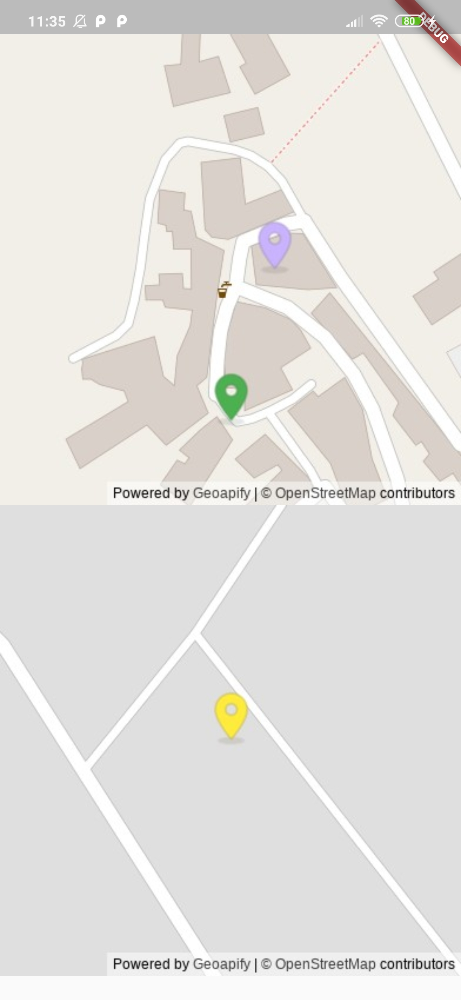

# fmaps

<p align="center">
<a href="https://github.com/Supercaly/fmaps/actions"></a>
<a href="https://pub.dev/packages/fmaps"></a>
</p>

A simple Flutter Package to display maps form different providers.

This package will display a static map in a widget.  
A static map is a map image that the user can't interact with, but it's  
as light weight as using a `NetworkImage` and it's really suited for a  
use case where we need to display lots of mini maps to the user without him doing nothing.

## Examples
<div style="text-align: center">
    <table>
        <tr>
            <td style="text-align: center">
                    
            </td>
            <td style="text-align: center">
                    
            </td>
        </tr>
    </table>
</div>


## Usage
To use this package add fmaps as a [dependency in your pubspec.yaml file.](https://flutter.dev/docs/development/packages-and-plugins/using-packages)

```dart
import 'package:fmaps/fmaps.dart';

class MapWidget extends StatelessWidget {
  @override
  Widget build(BuildContext context) {
    return Scaffold(
      body: FMaps(
          options: MapOptions(
            center: LatLng(0.0, 0.0),
            zoom: 17.0,
            markers: [
              Marker(
                position: LatLng(0.0, 0.0),
              ),
            ],
          ),
          provider:
              GeoapifyMapProvider(apiKey: "your-api-key"),
        ),
    );
  }
}
```

### Map Options
When creating an `FMaps` widget you must give an instance of `MapOptions`;  
this class contains all the properties that can be customized in the map like:

* center
* zoom
* area
* markers
* placeholder

#### Position
The most important parameter is the geographical position of the map (which bit of earth will be shown in the map); this can be achieved in two ways:

1. center/zoom -> specify the center of the map as latitude and longitude and   a zoom level
2. area -> specify a pair of point (each with latitude and longitude) as the bounding box of the map

#### Markers
A marker is really useful for marking point of the map and sometimes the situation requires more than one; because of this  
in the option can be specified a list of markers each one with a `position` and a `color`.

```dart
Marker m = Marker(
  position: LatLng(0.0, 0.0),
  color: Colors.red,
);  
```
#### Placeholder
When loading the map from the web a placeholder image can be customized. The default is a all-grey image.

### Map Provider
The map provider is the core component of this system, his role is to provide the map from the web.

On the web there are a lot of map providers services, some are free, other are payed. Because of this `fmaps` let the developer choose what service he wants exposing a simple API.

In the package we have already implemented two MapProviders to make the thing simpler; those are for the services:

* [Geoapify](https://geoapify.com/)
* [Thunderforest](https://www.thunderforest.com/)

Both are payed services with a free usage (as long as you don't exceed the monthly usage limit).

To use another map provider all that's needed is to extend the `MapProvider` class with the specific implementation.

```dart
class MyMapProvider extend MapProvider {
  const MyMapProvider({String apiKey}): super(apiKey: apiKey);

  @override
  ImageProvider getStaticMap(int width, int height, MapOptions opt) {
    final url = ""; // Generate the url for your provider
    return NetworkImage(url);
  }
}
```

### Top level map provider
Sometimes the use case of our app requires the presence of multiples `FMaps` all instantiated with the same `MapProvider`.  
In this case a top level `FMapsProvider` can be use to provide the instance of the MapProvider to all of his children  
rather than repeating the provider in every FMaps widget.

```dart
class DoubleMapWithProvider extends StatelessWidget {
  @override
  Widget build(BuildContext context) {
    return Scaffold(
      body: SafeArea(
        child: FMapsProvider(
          provider:
              GeoapifyMapProvider(apiKey: "ef924a4dd7464d58a1f295e9e7efafbd"),
          child: ListView(children: [
            FMaps(
              options: MapOptions(
                center: LatLng(43.840964, 12.412731),
                zoom: 17.0,
                markers: [
                  Marker(
                    position: LatLng(43.840464, 12.412731),
                    color: Colors.green,
                  ),
                ],
              ),
            ),
            FMaps(
              options: MapOptions(
                center: LatLng(43.840964, 12.412731),
                zoom: 17.0,
                markers: [
                  Marker(
                    position: LatLng(43.840964, 12.412931),
                    color: Color.fromARGB(255, 201, 178, 254),
                  ),
                ],
              ),
            ),
          ]),
        ),
      ),
    );
  }
}
```